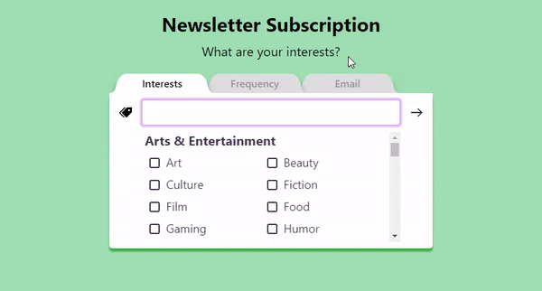

<div align="center">
  <h1><a href="https://z2lai.github.io/react-emotion-multi-step-form/">React Emotion Multi-step Form</a></h1>

  > A multi-step form component library built with React and styled with Emotion

  [](https://www.npmjs.com/package/react-emotion-multi-step-form)

  [](https://z2lai.github.io/react-emotion-multi-step-form/)
</div>

## Introduction
A declarative component library where input components are displayed in a multi-step form format with smooth page transitions. It's built with React hooks and React Context API so that form state and input prop values can be reused for UI customization.

### Important Links
* [Demo the example app](http://z2lai.github.io/react-emotion-multi-step-form#example-app)
* [Learn how to get started](http://z2lai.github.io/react-emotion-multi-step-form#getting-started)
* [Demo the library](https://codesandbox.io/s/react-emotion-multi-step-form-subscription-form-h6mpc)

## Features
* Declarative configuration - captions, page height, input icon and input validation
* Smooth/Optimized page transition animations
* Accessible keyboard-only navigation
* Responsive design
* Custom hook to access form state and input prop values for UI customization
* Three Input Components:
  1. HTML Input with HTML5 form validation
  2. Single-select Input - Radio Input with declarative configuration of radio options
  3. Multi-select Input - Multi-select Combobox with Autocomplete and Typeahead

## Getting Started

### Peer Dependencies
The following packages are required to be installed as dependencies for using this library:
* react: ^16.8.0
* react-dom": ^16.8.0
* react-scripts: ^3.4.0
* @emotion/core: ^10.0.27
* @emotion/styled: ^10.0.27
* emotion-theming: ^10.0.27

### Installation
```bash
npm install --save react-emotion-multi-step-form
```

### Basic Usage
```jsx
import React from "react";
import {
  useInputs,
  FormBody,
  Input,
  RadioControl,
  RadioOption,
  withFormContextAndTheme,
} from "react-emotion-multi-step-form";

// Import SVG icons as React components using SVGR (built-in with create-react-app)
import { ReactComponent as LinkIcon } from "./assets/link.svg";
import { ReactComponent as TreeIcon } from "./assets/tree.svg";
import { ReactComponent as PriceTagsIcon } from "./assets/price-tags.svg";

function App() {
  const { error } = useInputs(); // grab the active input's error message
  const handleSubmit = (data) => {
    console.log(data);
  };

  return (
    <div>
      <FormBody onSubmit={handleSubmit}>
        <Input
          name="firstname" // name of each input component must be unique
          icon={LinkIcon} // icon to be displayed beside input component
          validationRules={{ required: true }}
        />
        <Input
          name="lastname"
          icon={TreeIcon}
          validationRules={{ required: true }} // default error message
        />
        <RadioControl
          name="age"
          icon={PriceTagsIcon}
          validationRules={{ required: "Please select an age group" }} // custom error message
        >
          <RadioOption value="<15" />
          <RadioOption value="15-64" />
          <RadioOption value="≥65" />
        </RadioControl>
      </FormBody>
      <div style={{ textAlign: "center", color: "red" }}>{error.message}</div>
    </div>
  );
}

// Wrap component with React Context.Provider and Emotion ThemeProvider
export default withFormContextAndTheme(App);
```

## Examples
Demo the library with the following CodeSandbox examples:
* [Basic Usage Example](https://codesandbox.io/s/react-emotion-multi-step-form-basic-example-mhibp)
* ["Subscription Form" Example](https://codesandbox.io/s/react-emotion-multi-step-form-subscription-form-h6mpc)

## API Reference
The components and custom hook described below are publicly exposed in the top-level module.

**Components**
- [`<FormBody>`](https://github.com/z2lai/react-emotion-multi-step-form#formbody)
- [Input Components](https://github.com/z2lai/react-emotion-multi-step-form#input-components)
  1. [`<Input>`](https://github.com/z2lai/react-emotion-multi-step-form#Input)
  2. [`<RadioControl>` and `<RadioOption>`](https://github.com/z2lai/react-emotion-multi-step-form#radiocontrol-and-radiooption)
  3. [`<ComboBoxMulti>`](https://github.com/z2lai/react-emotion-multi-step-form#comboboxmulti)
- [`<Captions>`](https://github.com/z2lai/react-emotion-multi-step-form#captions)

**HOCs & Hooks**
- [`withFormContextAndTheme` HOC](https://github.com/z2lai/react-emotion-multi-step-form#withformcontextandtheme-hoc)
- [`useInputs` hook](https://github.com/z2lai/react-emotion-multi-step-form#useinputs-hook)

### `<FormBody>`
The main component provided by the module which includes the body of the form, icon container, input container, navigation buttons, Tabs component and the Submit button. The icon container contains the icon of the currently active (displayed) input and the input container contains the active input (only one input can be active at a time). On click of the Next button, the active input is validated and the next input is made active if validation passes. The Submit button appears after the last input has been validated.

**Props**
Name | Type | Default | Description
-----|------|---------|------------
initialFocus | boolean | true | Specifies if the form (first input) should be focused on initial render
onSubmit | function | | Invoked when the Submit button on the final page is clicked on. Receives an object where the keys are the input names and the values are the input values.
submitText | string | 'Submit' | Text displayed on the Submit button
submitWidth | number | 110 | Width in pixels of the Submit button

**Children**

FormBody currently only accepts input components from this module as children. These input components will be contained within the input container and be displayed one at a time depending on which input is active.
```jsx
  <FormBody onSubmit={handleSubmit}>
    <Input name="firstname" />
    <Input name="lastname" />
  </FormBody>
```

### Input Components
This module provides the following custom input components to be used as form inputs within `FormBody`.
1. [`<Input>`](https://github.com/z2lai/react-emotion-multi-step-form#Input)
2. [`<RadioControl>` and `<RadioOption>`](https://github.com/z2lai/react-emotion-multi-step-form#radiocontrol-and-radiooption)
3. [`<ComboBoxMulti>`](https://github.com/z2lai/react-emotion-multi-step-form#comboboxmulti)

These input components all share the following props in common which allow them to be registered in `FormContext` and displayed appropriately:

#### **Base Props**
Name | Type | Default | Description
-----|------|---------|------------
name `required` | string | | HTML name attribute for inputs - must be **unique** within form.
onChange | function | | Invoked when controlled input value changes - receives the input value. **Note**: Input value state is managed internally and can also be retrieved with the `useInputs` hook.
label | string | | Label text to be displayed as a "tab" above the input - if not specified, `name` is displayed instead.
caption | string | | Caption to be displayed in the `<Captions>` custom component when this input is active.
icon | elementType | | An SVG file imported as a React component. Refer to [Basic Usage](https://github.com/z2lai/react-emotion-multi-step-form#basic-usage) for an example or see the section below on [importing SVG icons as React components](https://github.com/z2lai/react-emotion-multi-step-form#importing-svg-icons-as-react-components).
height | number | 60 | Specifies the height, in pixels, of the form body when this input is active. Includes top and bottom padding of 10px and excludes the tabs.
validationRules | object | | Specifies rules that the input is validated against on navigation to the next input (i.e. clicking the Next button). On the first rule validation failure, navigation is cancelled and the form goes into an error state until the input is validated again and passes. The default/custom error message can be retrieved from the `useInputs` hook. See below for all available validation rules.

#### Importing SVG Icons As React Components
Refer to the section in the Create React App documentation on [adding SVGs](https://create-react-app.dev/docs/adding-images-fonts-and-files/#adding-svgs).

#### Validation Rules
Input validation rules are passed as an object prop into each input component. The object contains the following key-value pairs where the key is the rule name and the value describes the validation criteria and/or the custom error message. The following table lists all of the available validation rules that `validationRules` can contain for all input components:
Key | Value Type | Default | Description
----------|------------|---------|------------
required | boolean \| string | | Specifies whether or not the input is required. Instead of `true`, a custom error message can be provided (as a string) to replace the default HTML5 validation message.
validate | function | | Custom validation function that accepts two arguments, input value and input name, and should return `true` if the input value is valid or a string containing the error message if the input value is invalid.

**Note:** Additional HTML5 validation rules can be defined for the [`<Input>`](https://github.com/z2lai/react-emotion-multi-step-form#Input) component.

**Example**
```jsx
  <ComboboxMulti
    name="interests"
    caption="What are your interests?"
    icon={PriceTagsIcon}
    validationRules={{
      validate: value => value.length >= 3 || 'Please select at least 3 topics.'
    }}
    options={options}
  />
```

#### `<Input>`
The component to be used for standard HTML inputs. It accepts the [base props](https://github.com/z2lai/react-emotion-multi-step-form#base-props) and the following props:

**Props**
Name | Type | Default | Description
-----|------|---------|------------
type | string | 'text' | HTML type attribute - see full list of [HTML input types](https://developer.mozilla.org/en-US/docs/Web/HTML/Element/input).
title | string | | HTML title attribute.
placeholder | string | | HTML placeholder attribute.

**HTML5 Validation Rules**

In addition to the validation rules listed [above](https://github.com/z2lai/react-emotion-multi-step-form#validation-rules), HTML5 validation rules can be specified for the `<Input>` component. The default error message for each HTML5 validation rule is the corresponding HTML5 validation message. Instead of a value, an object containing the value and a custom error message can be provided to replace the default HTML5 validation message. 

The following table lists all of the available HTML5 validation rules that `validationRules` can contain for the `<Input>` component:
Key | Value Type | Default | Description
----------|------------|---------|------------
minLength | number \| { value: number, message: string } | | Specifies the minimum number of characters for the appropriate input type.
maxLength | number \| { value: number, message: string } | | Specifies the maximum number of characters for the appropriate input type.
min | number \| { value: number, message: string } | | Specifies the minimum value for the appropriate input type.
max | number \| { value: number, message: string } | | Specifies the maximum value for the appropriate input type.
pattern | RegExp \| { value: RegExp, message: string } | | Specifies a JavaScript regular expression to be matched for the appropriate input type.

**Note:** Different HTML5 validation rules are supported by different input types according to this [table](https://developer.mozilla.org/en-US/docs/Web/Guide/HTML/HTML5/Constraint_validation#Validation-related_attributes).<br>
**Note:** HTML5 validation is automatically performed on inputs based on the [intrinsic constraints](https://developer.mozilla.org/en-US/docs/Web/Guide/HTML/HTML5/Constraint_validation#Semantic_input_types) set by the `type` attribute (e.g. `type="email"` or `type="URL"`).

**Example**
```jsx
  <Input 
    name="username" 
    caption="Choose a username."
    icon={LinkIcon}
    validationRules={{ 
      required: 'Please enter a username for your new account.',
      pattern: {
        value: "[a-z]{4,8}",
        message: "Usernames must be lowercase letters and 4-8 characters in length."
      }
    }}
  />
```

#### `<RadioControl>` and `<RadioOption>`
The component to be used for radio inputs (single-select). `<RadioControl>` accepts the [base props](https://github.com/z2lai/react-emotion-multi-step-form#base-props) and accepts multiple `<RadioOption>` input components as children.

`<RadioOption>` accepts the following props:

**Props (`<RadioOption>`)**
Name | Type | Default | Description
-----|------|---------|------------
value `required` | string \| number | | Value of the radio option.
label | string | | Label text of radio option - if not specified, `value` is displayed instead.

**Example**
```jsx
  <RadioControl
    name="frequency"
    caption="How often do you want to receive our newsletter?"
    icon={TreeIcon}
    validationRules={{ required: 'Please select a frequency' }}
  >
    <RadioOption value="daily" />
    <RadioOption value="weekly" />
    <RadioOption value="monthly" />
  </RadioControl>
```

#### `<ComboboxMulti>`
The component to be used for checkbox inputs (multi-select). It includes many features such as autocomplete/autofilter, typeahead, and tokens. The selected options will be stored as an array of strings. `<ComboboxMulti>` accepts the [base props](https://github.com/z2lai/react-emotion-multi-step-form#base-props) and the following props:

**Props**
Name | Type | Default | Description
-----|------|---------|------------
options | [array, array] | | An array of two arrays containing equal number of elements. The second array contains groups of checkbox options (represented by arrays of strings) and the first array contains the headings for each of these groups. See examples below.

**Examples**

If the checkbox options can be logically separated into multiple groups, then the array passed into the options prop should be in the following format:
```jsx
const options = [
  ['fruits', 'vegetables', 'meats'],
  [
    [
      'papaya',
      'kiwi',
      'watermelon',
      'dragon fruit',
    ],
    [
      'brocolli',
      'spinach',
    ],
    [
      'chicken',
      'pork',
      'beef',
    ],
  ]
]
```

Otherwise, the array passed into the options prop should be in the following format:
```jsx
const options = [
  ['colours'],
  [
    ['red', 'orange', 'yellow', 'green', 'blue', 'indigo', 'violet']
  ]
]
```

### `<Captions>`
This component uses the [`useInputs` hook](https://github.com/z2lai/react-emotion-multi-step-form#useinputs-hook) to display the caption of the currently active input. It accepts the following props:

**Props**
Name | Type | Default | Description
-----|------|---------|------------
callToActionText `required` | string | | Call-to-action text to be displayed on the final page with the Submit button.

### withFormContextAndTheme HOC
This higher-order component (HOC) provides the wrapped component with access to the theme and `FormContext` which stores the form state. This HOC must be called with the parent component as follows:
```jsx
const AppWithContextAndTheme = withFormContextAndTheme(App);
export default AppWithContextAndTheme;
```

Or simply:
```jsx
export default withFormContextAndTheme(App);
```

### useInputs Hook
This custom hook returns the following form state values from `FormContext`:

**Returned Values**
Name | Type | Initial Value | Description
-----|------|---------------|------------
inputs | Array\<Object\> | `[]` | An array of objects where each object contains the prop values of each input. Each input object contains prop-value pairs for the following props: `label`, `caption`, `icon` and `height`.<br>**Note**: On initial form render, `inputs` is always empty as all input components still need to be rendered once for their ref callbacks to "register" them in `inputs` (which triggers an immediate re-render).
activeIndex | number | `0` | An index from 0 to n where n is the number of inputs in the form. The index specifies which input is currently active: `0` refers to the first input and n refers to the Submit button which comes after the last input.
changeActiveIndex | function | | Accepts a number that should specify what to change `activeIndex` to (which input to make active). Input validation is performed on the currently active input only if the number is greater than activeIndex (going forward in the form).
activeInput | object | | The input object from `inputs` for the currently active input. `activeInput` is `null` when `activeIndex` = n.
error | { state: boolean, message: string } | `{ state: false, message: '' }` | Error object containing the error state of the form and the error message to display.<br>**Note**: `error.message` must be added to the form as it's not displayed by default.
isSubmitPage | boolean | false | Specifies if the form is on the last "page" with the Submit button.
inputValues | object | `{}` | An object containing all form values where each key is the input name and each value is the input value. `inputValues` gets updated every time `changeActiveIndex` is called (e.g. on click of the Next button).

**Example**

These values and functions can be used, as follows, to create a custom component for navigating backwards to previous inputs in the form:
```jsx
// All custom components not defined here are just styled components (Emotion) that only contain styling

// Labels component
const Labels = () => {
  const { inputs, activeIndex, changeActiveIndex, inputValues } = useInputs();

  return (
    <LabelsContainer>
      {(inputs.length > 0) ?
        inputs.map((input, index) => (
          <Label
            key={`${index}${input.name}`}
            label={input.label}
            inputValue={inputValues[input.name]}
            active={index === activeIndex}
            changeActiveIndex={() => changeActiveIndex(index)}
            activated={index < activeIndex}
          />
        ))
        : null // render null on initial form render
      }
    </LabelsContainer>
  )
}

// Label component
const Label = ({ 
  label, 
  inputValue, 
  active, 
  changeActiveIndex, 
  activated 
}) => {
  const handleClick = event => {
    if (!activated) return;
    changeActiveIndex();
  }

  return (
    <StyledLabel
      active={active} // for styling
      activated={activated} // for styling
      onClick={handleClick}
    >
      {inputValue || label}
    </StyledLabel>
  )
}
```

## Feature Roadmap
* Web accessibility (WCAG 2.1 conformance)
* Test coverage
* Customizable theme/more props to customize styling
* More input components:
 1. Range input (Slider)
 2. Toggle/Switch input
 3. Multi-select input - tag cloud format
* Ability to have multiple inputs on one page with declarative configuration
* Typescript support

## Browser Support
Recent versions of the following browsers are supported:
- Chrome
- Firefox

## Changelog

## Credits
- [React Bootstrap Typeahead](https://github.com/ericgio/react-bootstrap-typeahead) component by Eric Giovanola
- [react-rewards](https://github.com/thedevelobear/react-rewards) (confetti) component by Develobear (not included in library)

## License
[MIT](https://github.com/z2lai/react-emotion-multi-step-form/blob/master/LICENSE.md) © [Zheng Lai](https://github.com/z2lai)